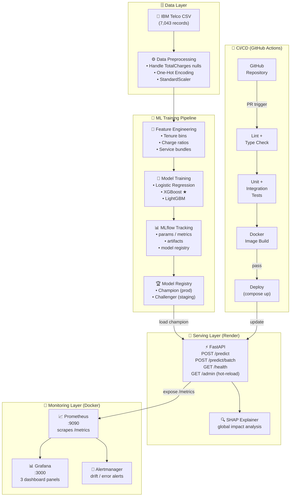
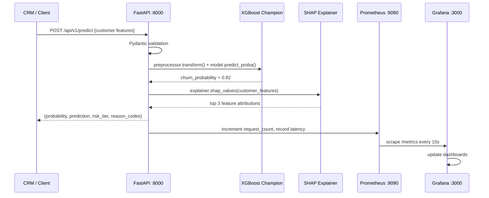

# TELCO CUSTOMER CHURN PREDICTION SYSTEM

## System Design & Architecture

> [!IMPORTANT]
> **Production Standard**: This system utilizes a decoupled, cloud-native architecture.
>
> - **Model Registry**: Models are served exclusively from the **DagsHub MLflow Registry**, allowing for instant rollouts and hot-reloads without downtime.
> - **Data Ingestion**: Training data is fetched dynamically from **Kaggle** during pipeline execution, ensuring a lightweight and version-controlled repository.

**Course:** DDM501 - AI in Production: From Models to Systems
**Dataset:** IBM Telco Customer Churn
**Prepared by:** Lê Huỳnh Trang
**Interactive Diagram:** [View Architecture Visual](docs/images/churn_prediction_architecture.html)
---------------------------------------------

## 1. HIGH-LEVEL ARCHITECTURE

The system follows a **layered ML platform architecture** composed of five independent but integrated layers:

```
┌─────────────────────────────────────────────────────────────────────┐
│                     [1] DATA LAYER                                  │
│   Telco CSV  ──►  Preprocessing  ──►  Feature Store (versioned)     │
└────────────────────────────┬────────────────────────────────────────┘
                             │
┌────────────────────────────▼────────────────────────────────────────┐
│                  [2] ML TRAINING PIPELINE                           │
│   Feature Engineering ──► Model Training ──► MLflow Tracking        │
│                                    └──────► Model Registry          │
└────────────────────────────┬────────────────────────────────────────┘
                             │  (champion model artifact)
┌────────────────────────────▼────────────────────────────────────────┐
│                  [3] SERVING LAYER                                  │
│   FastAPI  ──►  /predict  ──►  SHAP Explainer  ──►  Response JSON  │
│   (Docker)     /predict/batch                                        │
│                /health                                               │
└──────────────┬─────────────────────────────────────────────────────┘
               │ (exposes /metrics)
┌──────────────▼─────────────────────────────────────────────────────┐
│                 [4] MONITORING LAYER                                │
│   Prometheus ──► Grafana Dashboards ──► Alertmanager               │
│   (scrape)       Business | Model | System panels                   │
└─────────────────────────────────────────────────────────────────────┘

┌─────────────────────────────────────────────────────────────────────┐
│                   [5] CI/CD LAYER                                   │
│   GitHub Actions: Lint ──► Test ──► Build ──► Validate ──► Deploy  │
└─────────────────────────────────────────────────────────────────────┘
```

---

## 2. SYSTEM ARCHITECTURE DIAGRAM



---

## 3. COMPONENT DESIGN

### 3.1. Data Layer

| Component                      | Responsibility                                                          | Technology                   |
| ------------------------------ | ----------------------------------------------------------------------- | ---------------------------- |
| **Raw Data Store**       | Holds the original IBM Telco CSV                                        | Local filesystem / Git LFS   |
| **Data Validator**       | Schema check, null detection, value range validation                    | Pandera / Great Expectations |
| **Preprocessor**         | Handle `TotalCharges` whitespace, encode categoricals, scale numerics | scikit-learn Pipeline        |
| **Processed Data Store** | Versioned, split train/val/test artifacts                               | MLflow Artifacts             |

**Key Design Decision:** Use a `scikit-learn Pipeline` object (combining `ColumnTransformer` + `StandardScaler`) that is serialized together with the model. This prevents **training-serving skew** — the exact same preprocessing steps applied in training are applied at inference time.

---

### 3.2. ML Training Pipeline

| Component                      | Responsibility                                                          | Technology                      |
| ------------------------------ | ----------------------------------------------------------------------- | ------------------------------- |
| **Feature Engineering**  | Create derived features (tenure buckets, monthly-to-total charge ratio) | pandas + scikit-learn           |
| **Model Trainer**        | Train multiple candidate models; apply class weights for imbalance      | scikit-learn, XGBoost, LightGBM |
| **Hyperparameter Tuner** | Optimize XGBoost parameters                                             | Optuna or GridSearchCV          |
| **Cross-Validator**      | StratifiedKFold (k=5) to prevent data leakage                           | scikit-learn                    |
| **MLflow Tracker**       | Log all params, metrics, plots, and model artifacts                     | MLflow                          |
| **Model Registry**       | Promote best model to "Champion" stage                                  | MLflow Model Registry           |

**Training Pipeline Flow:**

```
raw CSV
  └── DataValidator.validate()
        └── Preprocessor.fit_transform()  ← fit on train split only
              └── FeatureEngineer.transform()
                    └── ModelTrainer.train_all_candidates()
                          └── MLflowLogger.log_experiment()
                                └── ModelRegistry.promote_champion()
```

---

### 3.2b. ML Training Pipeline — Data Processing Detail

> Source of truth: `ML_Pipeline.ipynb` / `ml_pipeline.py` (primary — Colab notebook exported as Python script) + `scripts/train_model.py` + `scripts/train_xgboost_recall.py`

#### Step 1 — Raw Data Ingestion

```
Dataset: IBM Telco Customer Churn (blastchar/telco-customer-churn on Kaggle)
File:    WA_Fn-UseC_-Telco-Customer-Churn.csv
Size:    7,043 records × 21 raw columns

ML_Pipeline.ipynb (Colab):  opendatasets.download(kaggle_url) → read_csv()
scripts/train_model.py:     pd.read_csv("data/WA_Fn-UseC_-Telco-Customer-Churn.csv")
```

#### Step 2 — Data Cleaning (`clean_telco_data()`)

| Action                      | Detail                                                                                                                              |
| --------------------------- | ----------------------------------------------------------------------------------------------------------------------------------- |
| **Lowercase columns** | `df.columns = [col.lower() for col in df.columns]` — normalise all column names                                                  |
| **Drop CustomerID**   | PII removed — not a feature, prevents data leakage                                                                                 |
| **Fix TotalCharges**  | New customers (tenure=0) have `TotalCharges = ' '` (whitespace). Fix: `pd.to_numeric(..., errors='coerce')` then `.fillna(0)` |
| **Encode target**     | `churn`: `{"Yes": 1, "No": 0}`                                                                                                  |

#### Step 3 — Feature Engineering (in `ML_Pipeline.ipynb` + `train_model.py`)

| Feature                    | Logic                                                                                            | Rationale                                                                       |
| -------------------------- | ------------------------------------------------------------------------------------------------ | ------------------------------------------------------------------------------- |
| **`tenure_group`** | `pd.cut(tenure, bins=[0,12,24,48,60,100], labels=["0-12m","12-24m","24-48m","48-60m","60m+"])` | Captures non-linear churn risk by tenure stage — new customers churn much more |

> Note: `tenure_group` is an **additional** derived feature on top of the raw `tenure` column (not a replacement). Both feed into the preprocessor as separate inputs — `tenure` goes to the numeric branch (StandardScaler), `tenure_group` goes to the categorical branch (OneHotEncoder).

#### Step 4 — Train/Test Split

```python
train_test_split(df, test_size=0.2, random_state=42, stratify=df["churn"])
# → ~5,635 train rows | ~1,408 test rows
# Stratified to preserve 26.5% churn ratio in both splits
```

#### Step 5 — Preprocessing Pipeline (`ColumnTransformer`)

```
Input: X_train (raw features, mixed types)

  ┌── Numeric columns (tenure, monthlycharges, totalcharges, seniorcitizen) ──┐
  │  1. SimpleImputer(strategy="median")  ← fill any remaining NaN            │
  │  2. StandardScaler()                  ← z-score normalisation             │
  └─────────────────────────────────────────────────────────────────────────┘

  ┌── Categorical columns (gender, contract, internetservice, ...) ──────────┐
  │  1. SimpleImputer(strategy="most_frequent") ← fill missing with mode     │
  │  2. OneHotEncoder(handle_unknown="ignore")  ← binary dummy variables     │
  └─────────────────────────────────────────────────────────────────────────┘

Output: Dense/sparse feature matrix — fit on train only, transform on test
        (prevents training-serving skew)
```

> **Anti-leakage guarantee:** `preprocessor.fit()` is called ONLY on `X_train`. `X_test` is transformed using the already-fitted preprocessor. The entire fitted pipeline (preprocessor + model) is serialised together to DagsHub Registry, so inference at serving time uses the exact same scaling parameters.

#### Step 6 — Class Imbalance Handling

```
Method: SMOTE (Synthetic Minority Oversampling Technique)
Applied: Inside ImbPipeline AFTER preprocessor, BEFORE classifier
         → SMOTE only sees training data (no leakage)
Ratio:   Minority class (Churn=1, ~26.5%) oversampled to balance
Alternative used in colab script: scale_pos_weight = len(y==0) / len(y==1)
```

#### Step 7 — Model Training & Hyperparameter Search

| Source                              | Search Method                      | CV     | Scoring    | Models                                    | Experiment Name            |
| ----------------------------------- | ---------------------------------- | ------ | ---------- | ----------------------------------------- | -------------------------- |
| `ML_Pipeline.ipynb` *(primary)* | `RandomizedSearchCV` (n_iter=15) | 5-fold | `recall` | XGBoost, RandomForest, LogisticRegression | `Churn_Round2_Colab`     |
| `scripts/train_model.py`          | `RandomizedSearchCV` (n_iter=15) | 5-fold | `recall` | XGBoost, RandomForest, LogisticRegression | `Churn_Round2_Optimized` |
| `scripts/train_xgboost_recall.py` | `GridSearchCV`                   | 3-fold | `recall` | XGBoost only                              | local (no MLflow)          |

**XGBoost champion hyperparameters searched (all sources):**

```python
"clf__max_depth": [3, 4, 5, 6]
"clf__learning_rate": [0.01, 0.05, 0.1]
"clf__n_estimators": [100, 200, 300]
"clf__subsample": [0.8, 1.0]           # focused script only
"clf__colsample_bytree": [0.8, 1.0]    # focused script only
```

**Metrics logged to MLflow:**

```python
# ML_Pipeline.ipynb + train_model.py
mlflow.log_metric("recall", ...)       # Recall at best threshold
mlflow.log_metric("precision", ...)
mlflow.log_metric("f1_score", ...)
mlflow.log_metric("roc_auc", ...)      # train_model.py only (not in notebook)
mlflow.log_metric("bias_gap_gender", ...) # fairness audit both
mlflow.log_param("best_threshold", ...)
```

#### Step 8 — Threshold Optimisation

```python
# After training, find optimal classification threshold:
# → Target: Recall ≥ 0.80 with maximum Precision
precisions, recalls, thresholds = precision_recall_curve(y_test, y_probs)
best_threshold = threshold where recall >= 0.80 AND precision is maximized
# Default fallback: 0.50
```

> This is why `risk_tier` in the API is based on `churn_probability > 0.7` (High) — the serving layer applies its own threshold independently from training.

#### Step 9 — Model Registration to DagsHub MLflow

```
Training (ML_Pipeline.ipynb / scripts):
  mlflow.sklearn.log_model(
      best_model, "model",
      registered_model_name="CustomerChurnModel_{model_type}"
      # e.g. "CustomerChurnModel_xgboost", "CustomerChurnModel_random_forest"
  )

Promotion (manual via DagsHub UI):
  Rename/alias champion version → "CustomerChurnModel" (without suffix)
  OR set alias "latest" on the desired version

Serving (app/model.py):
  MLFLOW_MODEL_NAME = os.getenv("MLFLOW_MODEL_NAME", "CustomerChurnModel")
  model_uri = f"models:/{model_name}/latest"  # loads the aliased champion
  mlflow.sklearn.load_model(model_uri)

Fallback:
  Local pickle at models/churn_model.pkl.gz (baked into Docker image)
```

> **Important:** Training scripts register with suffix (`CustomerChurnModel_xgboost`). The serving layer reads `MLFLOW_MODEL_NAME` env var (default: `CustomerChurnModel`). The correct model name must be set in `.env` / Render Secret Files to match what was promoted in DagsHub.

---

### 3.3. Serving Layer

| Component                          | Responsibility                                                                                                                                                                      | Technology                             |
| ---------------------------------- | ----------------------------------------------------------------------------------------------------------------------------------------------------------------------------------- | -------------------------------------- |
| **FastAPI Application**      | Expose prediction endpoints, input validation, error handling                                                                                                                       | FastAPI + Uvicorn                      |
| **Model Loader**             | Load 'Latest' champion model artifact from DagsHub Registry on startup                                                                                                              | MLflow `mlflow.sklearn.load_model()` |
| **DagsHub Integration**      | Remote hosting for MLflow Tracking and Model Registry                                                                                                                               | DagsHub                                |
| **Explainability**           | SHAP `TreeExplainer` on XGBoost — top-3 feature attributions returned as **semantic string slugs** per prediction (e.g. `"contract_type_monthly"`, `"tenure_lt_12mo"`) |                                        |
| **SHAP Mapping Logic**       | Raw feature names from `preprocessor.get_feature_names_out()` are mapped to human-readable slug codes. See `app/model.py` for the mapping dictionary.                           |                                        |
| **ML Training Pipeline**     | Data cleaning → Feature Engineering → Preprocessing → SMOTE → Model Training → Threshold Optimization → MLflow Registry                                                       | See Section 3.2b                       |
| **Prometheus Middleware**    | Instrument all requests with latency and count metrics                                                                                                                              | `prometheus-fastapi-instrumentator`  |
| **Request/Response Schemas** | Pydantic models for input validation and response formatting                                                                                                                        | Pydantic v2                            |

**API Contracts (actual implementation):**

```
POST /predict
Request:  { "gender": "Female", "seniorcitizen": 0,
            "tenure": 12, "contract": "Month-to-month",
            ... 19 fields total, all lowercase }
Response: { "churn_probability": 0.82,
            "is_churn": true,
            "risk_tier": "High",
            "reason_codes": [
              "contract_type_monthly",
              "tenure_lt_12mo",
              "no_techsupport"
            ],
            "model_version": "v3" }
```

> **Note on API versioning:** Routes are mounted directly (e.g. `/predict`, not `/api/v1/predict`). API version is communicated via the `model_version` field in the response and the FastAPI `version` metadata — not via URL prefix. This simplifies deployment on Render without a reverse proxy.

**Input Guardrails (enforced by Pydantic + main.py):**

- `tenure`: 0–360 months *(code allows up to 360 to handle edge cases beyond standard Telco data range of ~72 months)*
- `totalcharges`: ≥ 0
- `seniorcitizen`: 0 or 1 (integer, not string)
- All string fields: case-sensitive exact match (e.g. `"Fiber optic"`, not `"fiber"`)

---

### 3.4. Monitoring Layer

| Component              | Responsibility                                              | Technology   |
| ---------------------- | ----------------------------------------------------------- | ------------ |
| **Prometheus**   | Scrape metrics from FastAPI `/metrics` endpoint every 15s | Prometheus   |
| **Grafana**      | Visualize time-series metrics in 3 dashboard panels         | Grafana      |
| **Alertmanager** | Fire alerts when thresholds breached (error rate, latency)  | Alertmanager |

> **Note on Drift Detection:** A Drift Detector component (Evidently AI / PSI calculation) is documented in the design intent but **not implemented in code**. Drift monitoring would require a batch job with historical reference data — out of scope for this iteration given the static Telco dataset.

**What IS monitored (via Prometheus metrics in `app/metrics.py`):**

- `http_requests_total` — request count by method/endpoint/status
- `http_request_duration_seconds` — P50/P95/P99 latency
- `prediction_count` — predictions served per model version
- `prediction_latency_seconds` — inference time per prediction
- `prediction_by_gender` — churn probability distribution segmented by gender (fairness)
- `model_loaded` — gauge: 1 if model loaded, 0 if fallback
- `model_last_reload` — timestamp of last hot-reload

**Grafana Dashboards (actual — from `grafana/dashboards/`):**

#### Dashboard 1 — Customer Churn ML Dashboard (`ml_dashboard.json`)

> uid: `ml-metrics` | refresh: 10s | tags: ml, model, ddm501

| Panel                                   | Type             | Metric                                                            |
| --------------------------------------- | ---------------- | ----------------------------------------------------------------- |
| **Model Status**                  | stat (green/red) | `ml_model_loaded`                                               |
| **Average Prediction**            | gauge            | `histogram_quantile(0.5, rate(ml_prediction_value_bucket[5m]))` |
| **Prediction Rate**               | stat             | `rate(ml_predictions_total[5m])`                                |
| **Error Rate**                    | stat             | `rate(ml_prediction_errors_total[5m])`                          |
| **Prediction Rate Over Time**     | timeseries       | `rate(ml_predictions_total[5m])` by model_version               |
| **Prediction Latency**            | timeseries       | P50 / P95 / P99 of `ml_prediction_duration_seconds`             |
| **Prediction Value Distribution** | bargauge         | `sum(increase(ml_prediction_value_bucket[1h])) by (le)`         |
| **Prediction Errors**             | timeseries       | `rate(ml_prediction_errors_total[5m])` by error_type            |

#### Dashboard 2 — System Metrics Dashboard (`system_dashboard.json`)

> uid: `system-metrics` | refresh: 10s | tags: api, system, ddm501

| Panel                              | Type       | Metric                                                                       |
| ---------------------------------- | ---------- | ---------------------------------------------------------------------------- |
| **Request Rate**             | timeseries | `rate(http_requests_total[5m])` by method/endpoint                         |
| **Request Latency (P95)**    | timeseries | `histogram_quantile(0.95, rate(http_request_duration_seconds_bucket[5m]))` |
| **Error Rate**               | stat (%)   | `rate(http_requests_total{status=~"[45].."[5m]) / total * 100`             |
| **Status Code Distribution** | piechart   | `sum by (status)(rate(http_requests_total[5m]))`                           |
| **Requests by Endpoint**     | table      | `sum by (endpoint)(rate(http_requests_total[5m]))`                         |
| **System CPU Usage (%)**     | timeseries | `100 - avg(rate(node_cpu_seconds_total{mode='idle'}[5m])) * 100`           |

---

### 3.5. CI/CD Pipeline

| Stage             | Action                                                                  | Tool                        |
| ----------------- | ----------------------------------------------------------------------- | --------------------------- |
| **Trigger** | On push to `main` or PR opened                                        | GitHub Actions              |
| **Lint**    | `flake8`, `black --check`, `mypy` type checking                   | Pre-commit hooks + GA       |
| **Test**    | Unit tests + Integration tests + Data quality tests + coverage ≥ 80%   | `pytest` + `pytest-cov` |
| **Build**   | Build and tag Docker image                                              | Docker                      |
| **Deploy**  | `docker compose up -d` (local) / trigger Render webhooks (production) | Docker Compose / Render     |

---

## 4. DATA FLOW DIAGRAM



**Edge Cases Handled:**

| Edge Case                       | Handling                                                                    |
| ------------------------------- | --------------------------------------------------------------------------- |
| Missing feature in request      | Pydantic returns 422 with field-level error message                         |
| Model file not found on startup | Application fails fast with clear error log; health check returns 503       |
| SHAP computation timeout        | SHAP result excluded; prediction still returned with `reason_codes: null` |
| Batch request > 1,000 records   | Returns 400: "Batch size limit exceeded. Max: 1,000 per request."           |

---

## 5. TECHNOLOGY STACK JUSTIFICATION

| Layer                         | Technology                                | Why Chosen                                                                                        | Alternative Considered                                            |
| ----------------------------- | ----------------------------------------- | ------------------------------------------------------------------------------------------------- | ----------------------------------------------------------------- |
| **API Framework**       | FastAPI                                   | Async-native, automatic OpenAPI docs, Pydantic validation, fastest Python framework               | Flask (no async, manual docs), Django REST (too heavy)            |
| **ML Models**           | XGBoost, RandomForest, LogisticRegression | Best-in-class for tabular data; SMOTE for imbalance; fast inference                               | Neural networks (overkill for 21 features), LR only (underpowers) |
| **Experiment Tracking** | DagsHub (Hosted MLflow)                   | Cloud-hosted, eliminates the need for manual server maintenance; persistent model registry        | Weights & Biases (paid tier limits), Neptune (paid)               |
| **Explainability**      | SHAP                                      | Model-agnostic TreeExplainer is fast for XGBoost; produces additive, consistent attributions      | LIME (slower, less consistent), ELI5 (deprecated)                 |
| **Containerization**    | Docker + Compose                          | Reproducible across environments; required by course rubric; simplest multi-service orchestration | Kubernetes (over-engineered for this scale), bare processes       |
| **Monitoring**          | Prometheus + Grafana                      | Industry standard; pre-built FastAPI exporter; Grafana has rich visualization; course requirement | Datadog (paid), CloudWatch (AWS-only)                             |
| **CI/CD**               | GitHub Actions                            | Free for public repos; YAML-based; native Docker support; course requirement                      | Jenkins (requires self-hosted), CircleCI (paid features)          |

---

## 6. TRADE-OFF ANALYSIS

### 6.1. Scalability vs. Complexity

| Decision                                         | Chosen                         | Trade-off                                                                                                                                                   |
| ------------------------------------------------ | ------------------------------ | ----------------------------------------------------------------------------------------------------------------------------------------------------------- |
| **Single-container API** vs. microservices | Single FastAPI container       | ✅ Simple deployment, easier debugging. ❌ Cannot scale individual components independently. Acceptable for course project and ≤ 10 req/s load.            |
| **Synchronous inference** vs. async queue  | Synchronous (request-response) | ✅ Simple implementation, low latency for single predictions. ❌ Blocks on long batch jobs. Mitigated by separate `/predict/batch` endpoint with timeout. |
| **Local MLflow** vs. cloud MLflow          | Local (Docker)                 | ✅ No external dependencies, fully reproducible. ❌ Not scalable to team of 5+. Acceptable for 3–4 member team.                                            |

### 6.2. Model Performance vs. Serving Latency

| Decision                                 | Impact                                                                                                                           |
| ---------------------------------------- | -------------------------------------------------------------------------------------------------------------------------------- |
| **SHAP on every prediction**       | Adds ~30–50ms per request. Acceptable (<150ms SLA). If latency is critical, SHAP can be computed async and cached per customer. |
| **XGBoost over TabNet**            | XGBoost is 10× faster at inference with comparable accuracy on tabular data. TabNet is relegated to experimental role.          |
| **No model caching by customerID** | Simplifies implementation. For production, a Redis cache of recent predictions would reduce redundant computation.               |

### 6.3. Cost vs. Observability

| Decision                                 | Impact                                                                                            |
| ---------------------------------------- | ------------------------------------------------------------------------------------------------- |
| **Self-hosted Prometheus+Grafana** | Zero cost, full control. Requires manual setup vs. managed solutions.                             |
| **No distributed tracing**         | Removed Jaeger/Zipkin to reduce complexity. API logs provide sufficient debugging for this scale. |

---

## 7. DOCKER COMPOSE SERVICE MAP

> Source of truth: `docker-compose.yml`

| Service                 | Container Name         | Port          | Image / Build                      | Key Config                                                                                          |
| ----------------------- | ---------------------- | ------------- | ---------------------------------- | --------------------------------------------------------------------------------------------------- |
| **api**           | `customer-churn-api` | `8000:8000` | `build: .` (local Dockerfile)    | healthcheck:`GET /health` every 30s; vol: `./models:/app/models`                                |
| **prometheus**    | `prometheus`         | `9090:9090` | `build: ./prometheus/Dockerfile` | scrapes `api:8000/metrics` + `node-exporter:9100`; vol: `prometheus_data`                     |
| **grafana**       | `grafana`            | `3000:3000` | `grafana/grafana:10.2.2`         | depends_on: prometheus; vols:`grafana_data`, `./grafana/provisioning`, `./grafana/dashboards` |
| **node-exporter** | `node-exporter`      | `9100:9100` | `prom/node-exporter:v1.7.0`      | system-level metrics (CPU, memory, disk, network)                                                   |

---

*Document version: 1.0 | Created: 2026-04-15 | Course: DDM501 Final Project*
