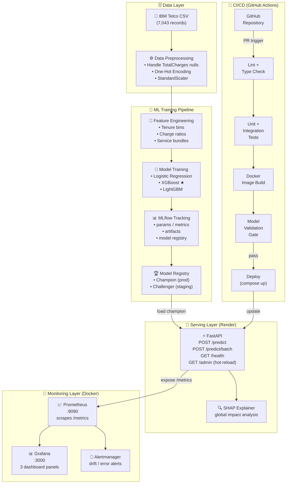
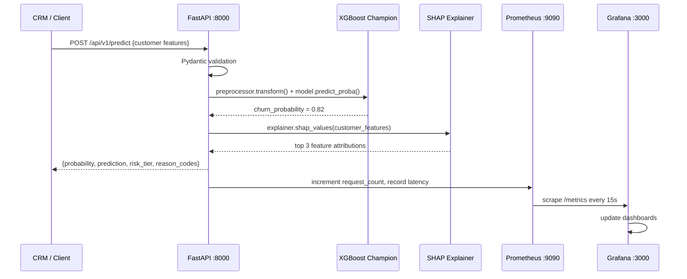

# TELCO CUSTOMER CHURN PREDICTION SYSTEM
## System Design & Architecture

> [!IMPORTANT]
> **Production Standard**: This system utilizes a decoupled, cloud-native architecture. 
> - **Model Registry**: Models are served exclusively from the **DagsHub MLflow Registry**, allowing for instant rollouts and hot-reloads without downtime.
> - **Data Ingestion**: Training data is fetched dynamically from **Kaggle** during pipeline execution, ensuring a lightweight and version-controlled repository.

**Course:** DDM501 - AI in Production: From Models to Systems
**Dataset:** IBM Telco Customer Churn
**Prepared by:** Lê Huỳnh Trang
**Interactive Diagram:** [View Architecture Visual](docs/images/churn_prediction_architecture.html)
---

## 1. HIGH-LEVEL ARCHITECTURE

The system follows a **layered ML platform architecture** composed of five independent but integrated layers:

```
┌─────────────────────────────────────────────────────────────────────┐
│                     [1] DATA LAYER                                  │
│   Telco CSV  ──►  Preprocessing  ──►  Feature Store (versioned)     │
└────────────────────────────┬────────────────────────────────────────┘
                             │
┌────────────────────────────▼────────────────────────────────────────┐
│                  [2] ML TRAINING PIPELINE                           │
│   Feature Engineering ──► Model Training ──► MLflow Tracking        │
│                                    └──────► Model Registry          │
└────────────────────────────┬────────────────────────────────────────┘
                             │  (champion model artifact)
┌────────────────────────────▼────────────────────────────────────────┐
│                  [3] SERVING LAYER                                  │
│   FastAPI  ──►  /predict  ──►  SHAP Explainer  ──►  Response JSON  │
│   (Docker)     /predict/batch                                        │
│                /health                                               │
└──────────────┬─────────────────────────────────────────────────────┘
               │ (exposes /metrics)
┌──────────────▼─────────────────────────────────────────────────────┐
│                 [4] MONITORING LAYER                                │
│   Prometheus ──► Grafana Dashboards ──► Alertmanager               │
│   (scrape)       Business | Model | System panels                   │
└─────────────────────────────────────────────────────────────────────┘

┌─────────────────────────────────────────────────────────────────────┐
│                   [5] CI/CD LAYER                                   │
│   GitHub Actions: Lint ──► Test ──► Build ──► Validate ──► Deploy  │
└─────────────────────────────────────────────────────────────────────┘
```

---

## 2. SYSTEM ARCHITECTURE DIAGRAM



---

## 3. COMPONENT DESIGN

### 3.1. Data Layer

| Component | Responsibility | Technology |
|---|---|---|
| **Raw Data Store** | Holds the original IBM Telco CSV | Local filesystem / Git LFS |
| **Data Validator** | Schema check, null detection, value range validation | Pandera / Great Expectations |
| **Preprocessor** | Handle `TotalCharges` whitespace, encode categoricals, scale numerics | scikit-learn Pipeline |
| **Processed Data Store** | Versioned, split train/val/test artifacts | MLflow Artifacts |

**Key Design Decision:** Use a `scikit-learn Pipeline` object (combining `ColumnTransformer` + `StandardScaler`) that is serialized together with the model. This prevents **training-serving skew** — the exact same preprocessing steps applied in training are applied at inference time.

---

### 3.2. ML Training Pipeline

| Component | Responsibility | Technology |
|---|---|---|
| **Feature Engineering** | Create derived features (tenure buckets, monthly-to-total charge ratio) | pandas + scikit-learn |
| **Model Trainer** | Train multiple candidate models; apply class weights for imbalance | scikit-learn, XGBoost, LightGBM |
| **Hyperparameter Tuner** | Optimize XGBoost parameters | Optuna or GridSearchCV |
| **Cross-Validator** | StratifiedKFold (k=5) to prevent data leakage | scikit-learn |
| **MLflow Tracker** | Log all params, metrics, plots, and model artifacts | MLflow |
| **Model Registry** | Promote best model to "Champion" stage | MLflow Model Registry |

**Training Pipeline Flow:**
```
raw CSV
  └── DataValidator.validate()
        └── Preprocessor.fit_transform()  ← fit on train split only
              └── FeatureEngineer.transform()
                    └── ModelTrainer.train_all_candidates()
                          └── MLflowLogger.log_experiment()
                                └── ModelRegistry.promote_champion()
```

---

### 3.3. Serving Layer

| Component | Responsibility | Technology |
|---|---|---|
| **FastAPI Application** | Expose prediction endpoints, input validation, error handling | FastAPI + Uvicorn |
| **Model Loader** | Load 'Latest' champion model artifact from DagsHub Registry on startup | MLflow `mlflow.sklearn.load_model()` |
| **DagsHub Integration** | Remote hosting for MLflow Tracking and Model Registry | DagsHub |
| **SHAP Explainer** | Compute and cache TreeExplainer; return top-3 feature attributions | SHAP |
| **Prometheus Middleware** | Instrument all requests with latency and count metrics | `prometheus-fastapi-instrumentator` |
| **Request/Response Schemas** | Pydantic models for input validation and response formatting | Pydantic v2 |

**API Contracts:**

```
POST /api/v1/predict
Request:  { "customerID": "...", "gender": "Male", "SeniorCitizen": 0,
            "tenure": 12, "Contract": "Month-to-month", ... }
Response: { "customerID": "...", "churn_probability": 0.82,
            "prediction": "Churn",
            "risk_tier": "High",
            "reason_codes": [
              {"feature": "Contract_Month-to-month", "impact": +0.38},
              {"feature": "MonthlyCharges",           "impact": +0.22},
              {"feature": "TechSupport_No",            "impact": +0.18}
            ] }
```

---

### 3.4. Monitoring Layer

| Component | Responsibility | Technology |
|---|---|---|
| **Prometheus** | Scrape metrics from FastAPI `/metrics` endpoint every 15s | Prometheus |
| **Grafana** | Visualize time-series metrics in 3 dashboard panels | Grafana |
| **Alertmanager** | Fire alerts when thresholds breached (error rate, latency, drift) | Alertmanager |
| **Drift Detector** | Compare current prediction score distribution vs. reference baseline | Evidently AI (batch) / PSI calculation |

**Grafana Panel Design:**
- **Panel 1 — Business Pulse:** High-risk customer count, revenue-at-risk gauge, weekly trend
- **Panel 2 — Model Health:** Prediction score histogram, PSI bar chart, rolling Recall estimate
- **Panel 3 — System Health:** API latency P50/P95/P99, error rate, request throughput, container status

---

### 3.5. CI/CD Pipeline

| Stage | Action | Tool |
|---|---|---|
| **Trigger** | On push to `main` or PR opened | GitHub Actions |
| **Lint** | `flake8`, `black --check`, `mypy` type checking | Pre-commit hooks + GA |
| **Test** | Unit tests + Integration tests + Data quality tests | `pytest` + `pytest-cov` |
| **Build** | Build and tag Docker image | Docker |
| **Model Gate** | Load new model; run evaluation; must beat baseline ROC-AUC 0.85 | Custom Python script |
| **Deploy** | `docker compose up -d` (local) or push to registry (production) | Docker Compose |

---

## 4. DATA FLOW DIAGRAM



**Edge Cases Handled:**

| Edge Case | Handling |
|---|---|
| Missing feature in request | Pydantic returns 422 with field-level error message |
| Model file not found on startup | Application fails fast with clear error log; health check returns 503 |
| SHAP computation timeout | SHAP result excluded; prediction still returned with `reason_codes: null` |
| Batch request > 1,000 records | Returns 400: "Batch size limit exceeded. Max: 1,000 per request." |

---

## 5. TECHNOLOGY STACK JUSTIFICATION

| Layer | Technology | Why Chosen | Alternative Considered |
|---|---|---|---|
| **API Framework** | FastAPI | Async-native, automatic OpenAPI docs, Pydantic validation, fastest Python framework | Flask (no async, manual docs), Django REST (too heavy) |
| **ML Models** | XGBoost / LightGBM | Best-in-class for tabular data; built-in `scale_pos_weight` for imbalance; fast inference | Neural networks (overkill for 21 features), LR only (underpowers) |
| **Experiment Tracking** | DagsHub (Hosted MLflow) | Cloud-hosted, eliminates the need for manual server maintenance; persistent model registry | Weights & Biases (paid tier limits), Neptune (paid) |
| **Explainability** | SHAP | Model-agnostic TreeExplainer is fast for XGBoost; produces additive, consistent attributions | LIME (slower, less consistent), ELI5 (deprecated) |
| **Containerization** | Docker + Compose | Reproducible across environments; required by course rubric; simplest multi-service orchestration | Kubernetes (over-engineered for this scale), bare processes |
| **Monitoring** | Prometheus + Grafana | Industry standard; pre-built FastAPI exporter; Grafana has rich visualization; course requirement | Datadog (paid), CloudWatch (AWS-only) |
| **CI/CD** | GitHub Actions | Free for public repos; YAML-based; native Docker support; course requirement | Jenkins (requires self-hosted), CircleCI (paid features) |

---

## 6. TRADE-OFF ANALYSIS

### 6.1. Scalability vs. Complexity

| Decision | Chosen | Trade-off |
|---|---|---|
| **Single-container API** vs. microservices | Single FastAPI container | ✅ Simple deployment, easier debugging. ❌ Cannot scale individual components independently. Acceptable for course project and ≤ 10 req/s load. |
| **Synchronous inference** vs. async queue | Synchronous (request-response) | ✅ Simple implementation, low latency for single predictions. ❌ Blocks on long batch jobs. Mitigated by separate `/predict/batch` endpoint with timeout. |
| **Local MLflow** vs. cloud MLflow | Local (Docker) | ✅ No external dependencies, fully reproducible. ❌ Not scalable to team of 5+. Acceptable for 3–4 member team. |

### 6.2. Model Performance vs. Serving Latency

| Decision | Impact |
|---|---|
| **SHAP on every prediction** | Adds ~30–50ms per request. Acceptable (<150ms SLA). If latency is critical, SHAP can be computed async and cached per customer. |
| **XGBoost over TabNet** | XGBoost is 10× faster at inference with comparable accuracy on tabular data. TabNet is relegated to experimental role. |
| **No model caching by customerID** | Simplifies implementation. For production, a Redis cache of recent predictions would reduce redundant computation. |

### 6.3. Cost vs. Observability

| Decision | Impact |
|---|---|
| **Self-hosted Prometheus+Grafana** | Zero cost, full control. Requires manual setup vs. managed solutions. |
| **No distributed tracing** | Removed Jaeger/Zipkin to reduce complexity. API logs provide sufficient debugging for this scale. |

---

## 7. DOCKER COMPOSE SERVICE MAP

```yaml
# docker-compose.yml — Service Overview
services:
  api:          # FastAPI prediction service
    port: 8000
    depends_on: [mlflow]
    healthcheck: GET /health

  mlflow:       # MLflow tracking server + model registry
    port: 5000
    volumes: [./mlruns, ./artifacts]

  prometheus:   # Metrics collection
    port: 9090
    scrape: api:8000/metrics (every 15s)

  grafana:      # Dashboards
    port: 3000
    depends_on: [prometheus]

  # Optional: alertmanager (port 9093)
```

---

*Document version: 1.0 | Created: 2026-04-15 | Course: DDM501 Final Project*
