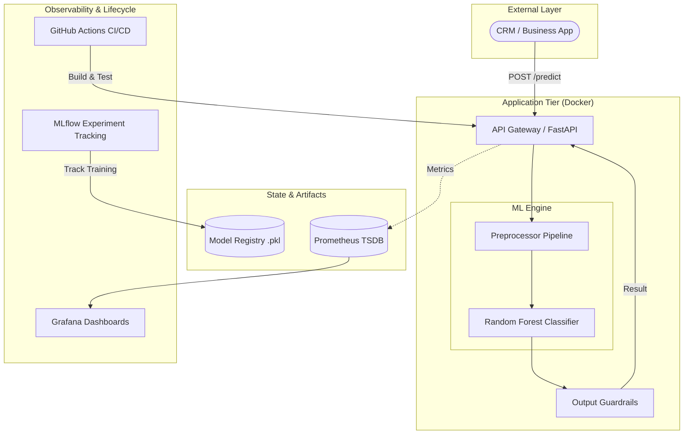
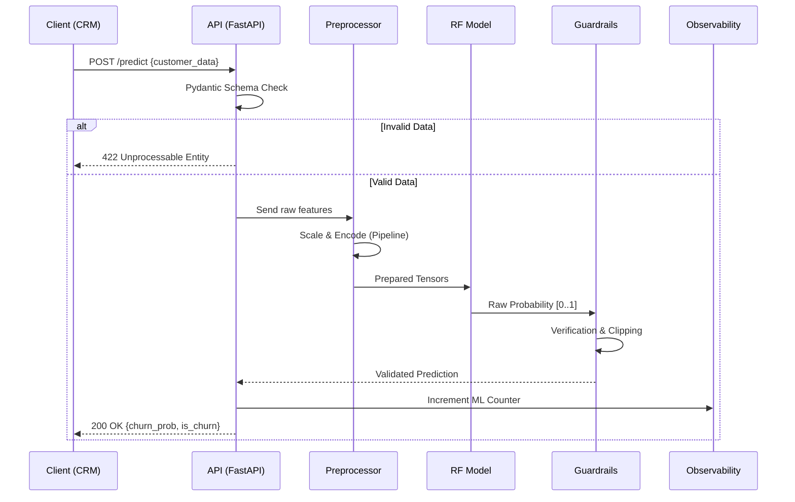

# System Architecture & Design Specification

This document provides a comprehensive breakdown of the Customer Churn Prediction System's architecture, data flows, and technical justifications.

## 1. High-Level System Architecture

Our system is built on a containerized microservices architecture optimized for low-latency inference and high observability.

## 2. Component Design & Responsibilities

| Component | Responsibility | Technology |
|:--- |:--- |:--- |
| **FastAPI Gateway** | Entry point for REST requests. Handles authentication (placeholder), routing, and async concurrency. | FastAPI, Uvicorn |
| **Pydantic Validation** | Enforces strict schema validation for the 10+ customer features. | Pydantic V2 |
| **Preprocessing Pipeline** | Handles missing value imputation, standard scaling, and one-hot encoding for categorical features. | Scikit-Learn Pipeline |
| **Inference Engine** | Executes the Random Forest ensemble weights to produce churn probabilities. | Scikit-Learn (Random Forest) |
| **Prometheus Exporter** | Exposes real-time system metrics (CPU/RAM) and ML metrics (Churn distribution, Error rate). | prometheus-client |
| **Grafana** | Provides visual health monitoring and business KPIs. | Grafana OSS |

## 3. Data Flow Diagram (Inference)

## 4. Technology Stack Justification

| Choice | Justification |
|:--- |:--- |
| **Python 3.9** | Industry standard for ML with mature library support. |
| **FastAPI** | High performance, type-safe, and auto-generates Swagger documentation. |
| **Random Forest** | Non-linear model that handles mixed data types (categorical/numeric) well and provides feature importance. |
| **MLflow** | Unifies experiment tracking, model versioning, and lifecycle management. |
| **Docker Compose** | Simplifies multi-service orchestration (API + Monitoring) for localized production environments. |

## 5. Trade-offs Analysis

### A. Scalability
- **Decision**: Stateless API design.
- **Trade-off**: Requires an external load balancer (like Nginx) to scale horizontally. Complexity increases slightly as stickiness is not preserved, but availability is maximized.

### B. Cost
- **Decision**: Open Source Stack (Prometheus/Grafana/FastAPI).
- **Trade-off**: Zero licensing costs. However, operational cost involves managing the overhead of the monitoring stack (TSDB storage).

### C. Complexity
- **Decision**: Monolithic Repository for API and Training.
- **Trade-off**: Easier for small teams to manage (CI/CD simplicity). Less suitable for hyper-scale teams where micro-repos are preferred.
