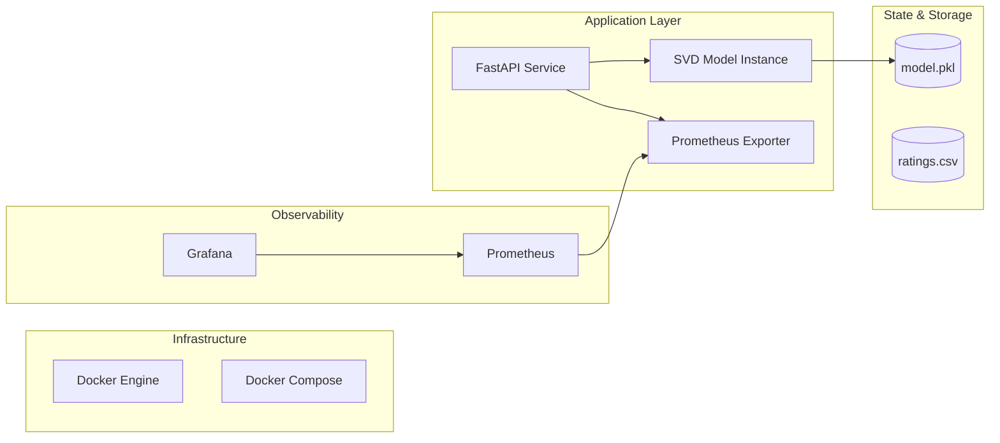

# System Architecture & Design

This document details the architectural decisions, component interactions, and technical trade-offs for the Movie Recommendation System.

## 1. High-Level Architecture

The system follows a classic **Predictive Service Pattern** where a trained model is wrapped in a REST API and continuously monitored.

## 2. Component Responsibilities

| Component | Responsibility | Technology |
|:--- |:--- |:--- |
| **Gateway/API** | Handles HTTP requests, validation, and serialization. | FastAPI, Pydantic |
| **ML Engine** | Performs matrix factorization for rating prediction. | Surprise (SVD) |
| **Observation** | Collects system and model-level latency/distribution. | Prometheus |
| **Visualization** | Provides actionable dashboards for stakeholders. | Grafana |
| **Orchestration** | Ensures all services are networked and replicable. | Docker Compose |

## 3. Data Flow

1.  **Ingestion**: Raw ratings are processed into a Surprise-compatible dataset.
2.  **Training**: SVD decomposes the user-item matrix into latent factors.
3.  **Inference**:
    *   API receives `user_id` and `movie_id`.
    *   Model retrieves latent vectors and computes the dot product.
    *   Result is clipped and returned with a latency timestamp.
4.  **Monitoring**: Every prediction increments a Counter and records value in a Histogram.

## 4. Technical Justifications & Trade-offs

### Why FastAPI?
- **Pro**: High performance (Asynchronous), auto-generated OpenAPI docs.
- **Trade-off**: Slightly higher learning curve than Flask, but significantly better for production throughput.

### Why SVD (Collaborative Filtering)?
- **Pro**: Effective at capturing latent relationships between users and items with minimal feature engineering.
- **Trade-off**: Suffers from the "Cold Start" problem (new users/movies). We handle this by returning a global mean or handled error.

### Why Docker Compose?
- **Pro**: Single-command deployment, ensures environment parity between dev and prod.
- **Trade-off**: Not suitable for massive horizontal scaling (K8s would be preferred for larger scales), but perfect for the scope of this project.

## 5. Scalability & Availability
- **Horizontal Scaling**: The API service is stateless and can be scaled using a load balancer (e.g., Nginx).
- **Health Checks**: Implemented in `docker-compose.yml` to ensure Prometheus only scrapes healthy instances.
