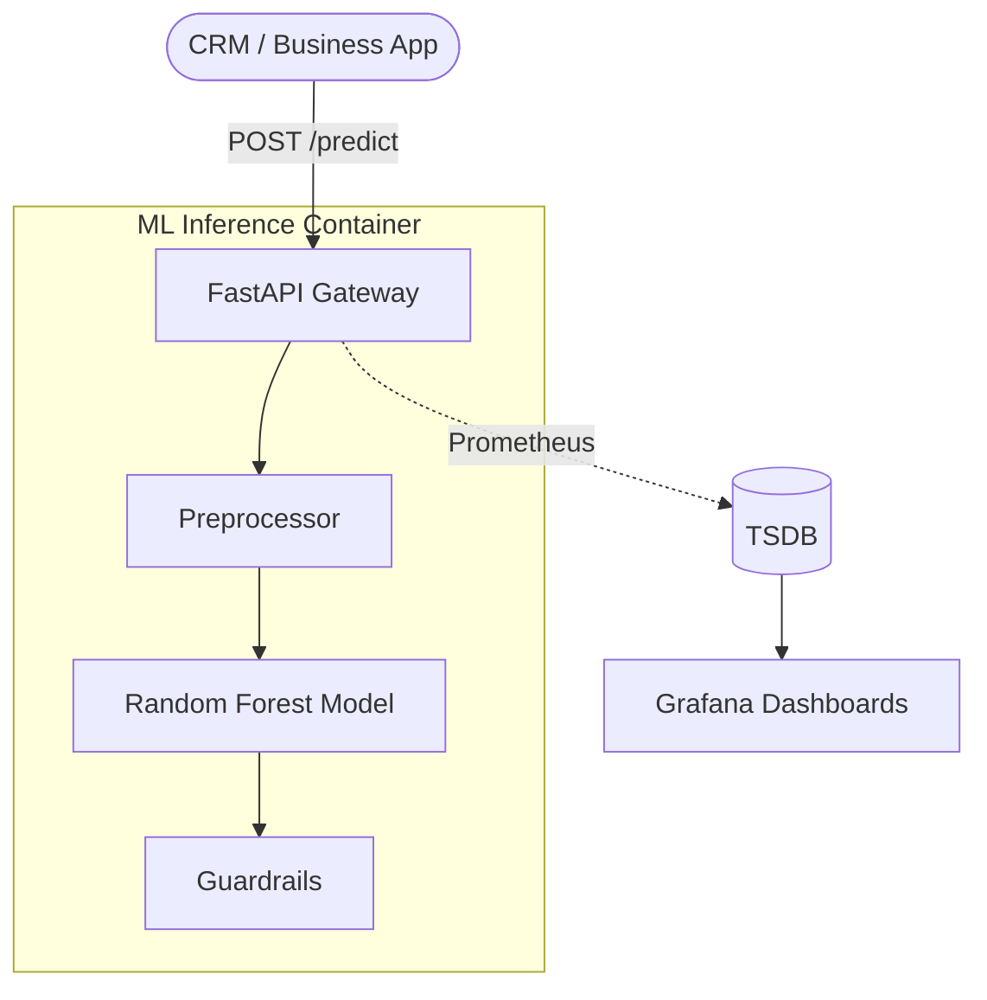

# CustomerChurn-Production: Predicting Customer Retention
[](https://github.com/bachnhan/msa24-ddm501-group6-final-project/actions)
[](https://fastapi.tiangolo.com)
[](https://www.docker.com)
[](https://prometheus.io)

## 📊 Project Overview

This project implements an end-to-end **Customer Churn Prediction System** for the **DDM501 - AI in Production** Capstone. Using industry-standard classification models (Random Forest), the system identifies customers at risk of leaving, enabling proactive retention strategies.

### 🎯 Problem Statement & Use Case
High customer churn rates directly impact profitability. Our system predicts the likelihood of churn based on behavioral patterns (usage frequency, support calls, payment delays), allowing marketing teams to offer targeted incentives to high-risk customers perfectly aligned with the [Kaggle Customer Churn Dataset](https://www.kaggle.com/datasets/muhammadshahidazeem/customer-churn-dataset).

## 🏗️ System Design & Architecture

Our system is built for **Scalability**, **Reliability**, and **Observability**. We follow a microservices-inspired architecture containerized with Docker.

### High-Level Architecture


### Inference Data Flow
1. **Request**: Client sends customer JSON features.
2. **Validation**: Pydantic ensures data integrity.
3. **Pipeline**: Scikit-Learn Pipeline handles scaling and one-hot encoding.
4. **Prediction**: Ensemble model generates churn probability.
5. **Guardrail**: System verifies output constraints and logs to Prometheus.

For detailed technology justifications and trade-off analysis, see [Architecture & Trade-offs](ARCHITECTURE.md).

---

## 📂 Project Structure
```text
.
├── app/
│   ├── main.py             # FastAPI churn endpoints
│   ├── model.py            # RF Classifier wrapper
│   ├── schemas.py          # Customer feature schemas
├── scripts/
│   ├── train_model.py      # Classification training (MLflow)
│   ├── explain_model.py    # Feature importance analysis
│   └── fairness_analysis.py# Bias detection (Gender/Tenure)
├── models/                 # Model pipeline (.pkl)
└── ...
```

---

## 🚀 Getting Started

### 1. Initial Setup
```bash
git clone git@github.com:bachnhan/msa24-ddm501-group6-final-project.git
cd msa24-ddm501-group6-final-project
python -m venv venv
source venv/bin/activate
pip install -r requirements.txt
```

### 2. Model Training
```bash
# Trains Random Forest and logs to MLflow
python scripts/train_model.py
```

### 3. Usage & Explanations
```bash
# Start API
uvicorn app.main:app --reload

# Explain predictions
python scripts/explain_model.py
```

---

## 📊 Monitoring & Observability

Our system implements a full-stack observability suite for reliable production serving.

### Service Access Links
| Service | URL | Default Credentials |
|:--- |:--- |:--- |
| **Prediction API** | [http://localhost:8000](http://localhost:8000) | N/A |
| **API Docs (Swagger)**| [http://localhost:8000/docs](http://localhost:8000/docs) | N/A |
| **Prometheus** | [http://localhost:9090](http://localhost:9090) | N/A |
| **Grafana** | [http://localhost:3000](http://localhost:3000) | `admin` / `admin` |

### Dashboards
- **System Metrics**: Real-time traffic analysis, error rates, and infrastructure (CPU/RAM) health.
- **ML Metrics**: Prediction probability distribution, model versioning, and latency quantiles (P50, P95, P99).

### Alerting Rules (C3)
1. **High Error Rate**: Triggered if 5xx responses exceed 5% within 1 minute.
2. **Slow Latency**: Triggered if P95 response time exceeds 500ms.
3. **Prediction Anomaly**: Detects drifts in median churn probability (>0.2 shift).
4. **Service Outage**: Immediate alert if the `churn-api` runner stops.

---

## ⚖️ Responsible AI
- **Explainability**: Uses Global Feature Importance to identify top churn drivers.
- **Fairness**: Monitors error rate parity between different user demographics.
- **Guardrails**: Validates input ranges (e.g., age, tenure) to prevent out-of-distribution errors.

---

## 📚 Documentation
- [Problem Statement & Business Context](docs/ProblemStatement.md)
- [Requirements & Use Cases](docs/Requirements.md)
- [Success Metrics](docs/SuccessMetrics.md)
- [Architecture & Trade-offs](ARCHITECTURE.md)
- [Fairness Analysis Report](scripts/fairness_analysis.py)
- [Model Explainability Guide](scripts/explain_model.py)
- [Contribution Roles](CONTRIBUTING.md)

---
© 2026 DDM501 Group 6 - AI in Production
