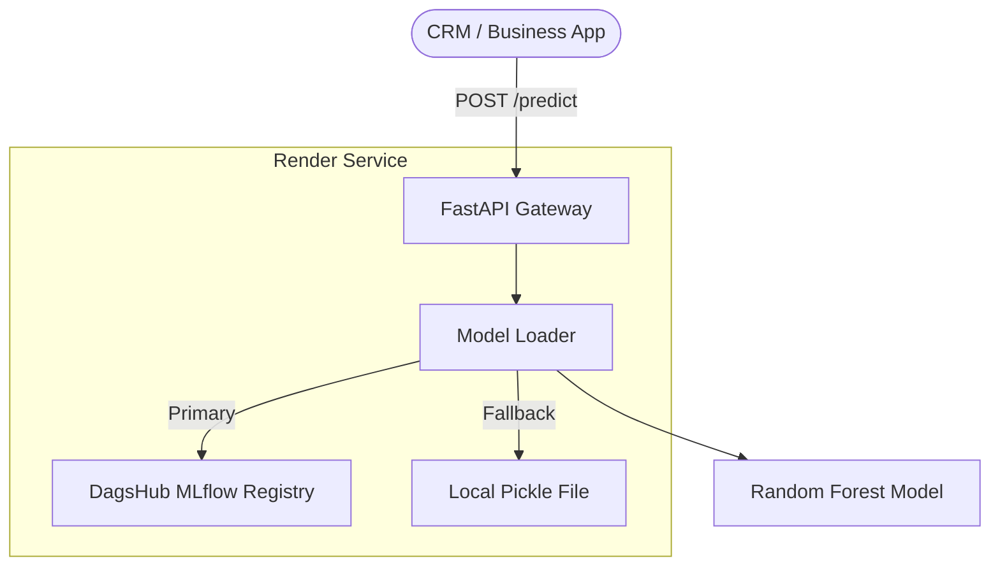

# CustomerChurn-Production: Predicting Customer Retention

> [!NOTE]
> **Educational Project**: This repository includes datasets and model binaries for demonstration purposes. In a professional MLOps environment, these would be managed externally via DVC and a secure Model Registry.
[](https://github.com/bachnhan/msa24-ddm501-group6-final-project/actions)
[](https://fastapi.tiangolo.com)
[](https://www.docker.com)
[](https://mlflow.org/)

## 📊 Project Overview

This project implements an end-to-end **Customer Churn Prediction System** for the **DDM501 - AI in Production** Capstone. It features a professional MLOps workflow using **DagsHub (MLflow)** as a Model Registry and **Render** for production serving.

## 🏗️ System Design & Architecture

### MLOps Workflow
1.  **Training**: Performed in stable cloud environments (e.g., Google Colab) to register models directly to the **DagsHub Registry**.
2.  **Versioning**: Every model iteration is versioned (v1, v2, v3) in the Central Registry.
3.  **Serving**: The FastAPI application on **Render** dynamically pulls the `latest` "Champion" model from the registry on startup.
4.  **High Availability**: A local baked-in model serves as a **fallback** if the cloud registry is unreachable, ensuring zero downtime.

### High-Level Architecture


---

## 🚀 Getting Started

### 1. Initial Setup
```bash
git clone git@github.com:bachnhan/msa24-ddm501-group6-final-project.git
cd msa24-ddm501-group6-final-project
python3 -m venv venv
source venv/bin/activate
pip install -r requirements.txt
```

### 2. Configure Environment
Create a `.env` file with your DagsHub credentials:
```env
MLFLOW_TRACKING_URI=https://dagshub.com/your-user/your-repo.mlflow
MLFLOW_TRACKING_USERNAME=your-user
MLFLOW_TRACKING_PASSWORD=your-token
MLFLOW_MODEL_NAME=CustomerChurnModel
```

### 3. Model Training & Registration
For best results (bypassing local network restrictions), it is recommended to run the training script in **Google Colab**:
1.  Load the `scripts/train_model.py` logic into a Colab notebook.
2.  Install dependencies: `!pip install mlflow dagshub scikit-learn pandas numpy`.
3.  Run to register the model as `v1`, `v2`, etc., in the DagsHub **Models** tab.

### 4. Local Serving
```bash
# Start API locally
uvicorn app.main:app --reload
```

---

## 📈 Monitoring & Observability
| Service | URL |
|:--- |:--- |
| **Prediction API** | [Render URL/predict] |
| **API Docs** | [Render URL/docs] |
| **Model Registry** | [DagsHub Models Tab] |

---

## ⚖️ Responsible AI
- **Explainability**: Global Feature Importance identifies top churn drivers.
- **Fairness**: Monitoring error rate parity across demographics (Gender, tenure).
- **Guardrails**: Input validation prevents out-of-distribution traffic from reaching the model.

---

## 📚 Documentation
- [Architecture & Trade-offs](ARCHITECTURE.md)
- [Success Metrics](docs/SuccessMetrics.md)
- [Fairness Analysis Report](scripts/fairness_analysis.py)

---
© 2026 DDM501 Group 6 - AI in Production
