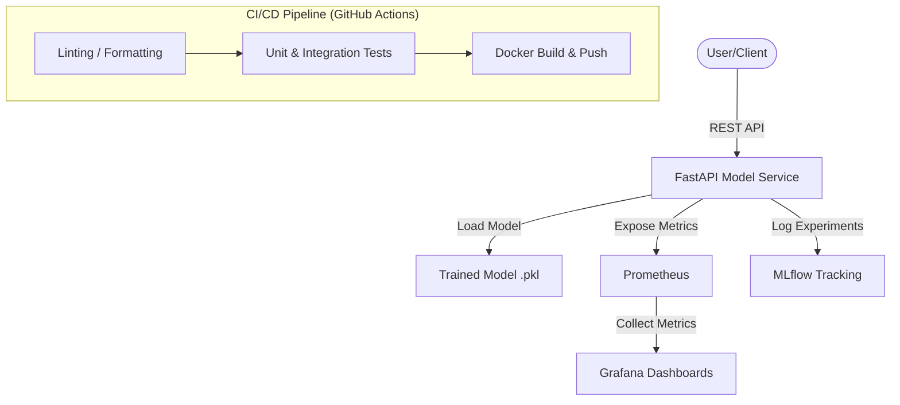

# MovieLens-Production: End-to-End Movie Recommendation System
[](https://github.com/bachnhan/msa24-ddm501-group6-final-project/actions)
[](https://fastapi.tiangolo.com)
[](https://www.docker.com)
[](https://prometheus.io)

## 🎥 Project Overview

This project implements a production-ready **Movie Recommendation System** for the **DDM501 - AI in Production** Capstone. We leverage Collaborative Filtering (SVD) to provide real-time rating predictions, integrated into a robust MLOps ecosystem.

### 🎯 Problem Statement & Use Case
In the modern streaming era, information overload prevents users from finding content they enjoy. Our system aims to increase user engagement by predicting movie ratings with high accuracy and low latency, enabling personalized content delivery for digital entertainment platforms.

---

## 🏗️ System Architecture

Our system is designed for scalability and observability, utilizing a microservices approach:



---

## 📂 Project Structure

```text
.
├── app/
│   ├── main.py             # FastAPI application
│   ├── model.py            # ML model wrapper & instrumentation
│   ├── metrics.py          # Prometheus metrics definitions
│   ├── middleware.py       # Metrics middleware
│   ├── schemas.py          # Pydantic schemas
│   └── config.py           # Configuration settings
├── prometheus/
│   ├── prometheus.yml      # Scrape configuration
│   └── alerts/             # Alerting rules
├── grafana/
│   └── provisioning/       # Datasources & Dashboards
├── scripts/
│   ├── train_model.py      # Model training script
│   └── load_test.py        # Load testing script
├── tests/                  # Pytest suite
├── models/                 # Model artifacts (.pkl)
├── .github/workflows/      # CI/CD Pipeline
├── Dockerfile              # Container definition
├── docker-compose.yml      # Orchestration
└── requirements.txt        # Dependencies
```

---

## 🚀 Getting Started (Detailed Setup)

### 1. Initial Setup
```bash
# Clone the repository
git clone git@github.com:bachnhan/msa24-ddm501-group6-final-project.git
cd msa24-ddm501-group6-final-project

# Create virtual environment
python -m venv venv
source venv/bin/activate  # Windows: venv\Scripts\activate

# Install dependencies
pip install -r requirements.txt
```

### 2. Model Training & Validation
Before running the API, you must train the model artifact:
```bash
# Trains SVD on MovieLens 100K and saves to models/svd_model.pkl
python scripts/train_model.py
```

### 3. Local Development (Standard API)
```bash
# Start FastAPI with hot-reload
uvicorn app.main:app --reload --host 0.0.0.0 --port 8000
```
- **API Docs**: [http://localhost:8000/docs](http://localhost:8000/docs)
- **Health Check**: [http://localhost:8000/health](http://localhost:8000/health)

### 4. Full Stack Deployment (Docker)
Deploys the API + Prometheus + Grafana stack:
```bash
# Build and start services in background
docker-compose up -d

# Verify services are running
docker-compose ps
```

---

## 📊 Monitoring & Observability

### Service Access Links
| Service | URL | Note |
|:--- |:--- |:--- |
| **API API** | [http://localhost:8000](http://localhost:8000) | Root endpoint |
| **API Metrics** | [http://localhost:8000/metrics](http://localhost:8000/metrics) | Prometheus scrape target |
| **Prometheus** | [http://localhost:9090](http://localhost:9090) | Query engine & Alerts |
| **Grafana** | [http://localhost:3000](http://localhost:3000) | Dashboards (admin/admin) |

### Key PromQL Metrics
- **Request Rate**: `rate(http_requests_total[5m])`
- **P95 Latency**: `histogram_quantile(0.95, rate(http_request_duration_seconds_bucket[5m]))`
- **Error Rate**: `rate(http_requests_total{status=~"5.."}[5m]) / rate(http_requests_total[5m])`
- **Prediction Value Dist**: `histogram_quantile(0.5, rate(ml_prediction_value_bucket[5m]))`

---

## ✅ Testing & Quality Assurance

### Automated Testing
```bash
# Run all tests with coverage
pytest tests/ --cov=app

# Run specific metrics tests
pytest tests/test_metrics.py -v
```

### Load Testing
```bash
# Simulate 100 users making concurrent predictions
python scripts/load_test.py
```

---

## 🛠️ Team & Contributions

| Member | Primary Responsibilities |
|:--- |:--- |
| **Lê Huỳnh Trang** | Problem Definition, ML Pipeline, Responsible AI (Bias/Fairness) |
| **Đỗ Trọng Minh Quân** | Requirements, Model Training, MLflow Integration, Documentation |
| **Nguyễn Huỳnh Bách Nhân** | System Architecture, Docker/API, Monitoring Stack, CI/CD Pipeline |

---

## 📚 Documentation Links
- [Architecture & Trade-offs](ARCHITECTURE.md)
- [Team Roles & Git Workflow](CONTRIBUTING.md)
- [MLflow Experiment Tracker](http://localhost:5000) (Coming Soon)

---
© 2026 DDM501 Group 6 - AI in Production
