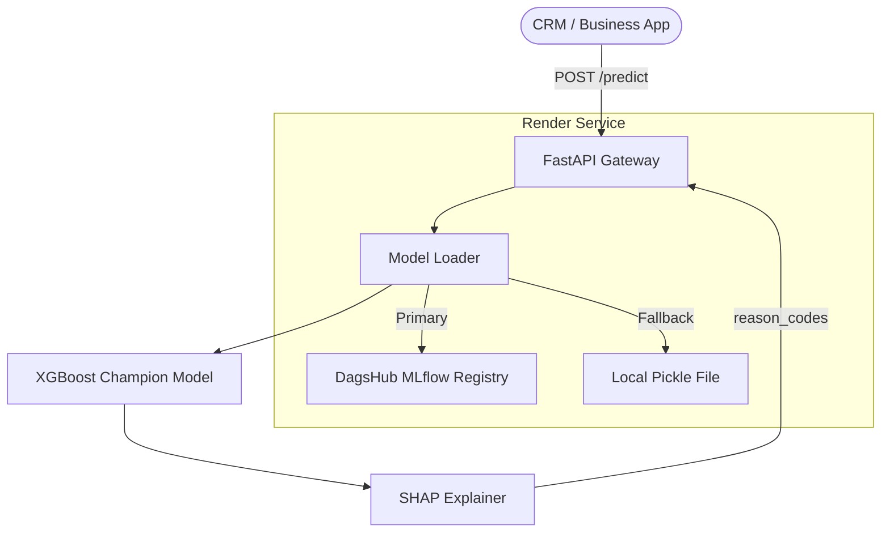

# CustomerChurn-Production: Predicting Customer Retention

> [!NOTE]
> **Educational Project**: This repository includes datasets and model binaries for demonstration purposes. In a professional MLOps environment, these would be managed externally via DVC and a secure Model Registry.

[](https://github.com/bachnhan/msa24-ddm501-group6-final-project/actions)
[](https://fastapi.tiangolo.com)
[](https://www.docker.com)
[](https://mlflow.org/)

## 📊 Project Overview

This project implements an end-to-end **Customer Churn Prediction System** for the **DDM501 - AI in Production** Capstone. It predicts whether a Telco customer will churn based on their service usage, contract type, and demographics, returning a risk score and explainable reason codes.

**Dataset:** IBM Telco Customer Churn (7,043 records, 26.5% churn rate)  
**Model:** XGBoost Champion (ROC-AUC ≥ 0.88, Recall ≥ 0.82)  
**Team:** Lê Huỳnh Trang · Đỗ Trọng Minh Quân · Nguyễn Huỳnh Bách Nhân

---

## 🏗️ System Design & Architecture

### MLOps Workflow
1. **Training**: Performed in Google Colab → registers models directly to the **DagsHub MLflow Registry**.
2. **Versioning**: Every model iteration is versioned (v1, v2, v3) in the Central Registry.
3. **Serving**: The FastAPI application dynamically pulls the `latest` "Champion" model from the registry on startup.
4. **High Availability**: A local baked-in model serves as a **fallback** if the cloud registry is unreachable.

### High-Level Architecture


---

## 🚀 Getting Started

### 1. Clone & Setup
```bash
git clone https://github.com/bachnhan/msa24-ddm501-group6-final-project.git
cd msa24-ddm501-group6-final-project
python -m venv venv

# Windows
venv\Scripts\activate

# Linux / macOS
source venv/bin/activate

pip install -r requirements.txt
```

### 2. Configure Environment
Create a `.env` file (copy from `.env.example`):
```env
MLFLOW_TRACKING_URI=https://dagshub.com/your-user/your-repo.mlflow
MLFLOW_TRACKING_USERNAME=your-user
MLFLOW_TRACKING_PASSWORD=your-token
MLFLOW_MODEL_NAME=CustomerChurnModel
```

> **Note:** Without `.env`, the API will automatically fall back to the local model at `models/churn_model.pkl.gz`. No configuration is required for local testing.

### 3. Run Locally (No Docker)
```bash
uvicorn app.main:app --reload --port 8000
```
- API Docs (Swagger UI): http://localhost:8000/docs
- Health Check: http://localhost:8000/health

### 4. Run with Docker Compose (Full Stack)
```bash
docker-compose up --build
```

| Service | URL |
|:--- |:--- |
| **Prediction API** | http://localhost:8000 |
| **Swagger UI** | http://localhost:8000/docs |
| **Prometheus** | http://localhost:9090 |
| **Grafana** | http://localhost:3000 (admin/admin) |
| **MLflow UI** | http://localhost:5000 |

---

## 📡 API Reference

### Endpoint Summary

| Method | Endpoint | Description |
|:--- |:--- |:--- |
| `GET` | `/health` | Check model load status |
| `POST` | `/predict` | Single customer churn prediction |
| `POST` | `/predict/batch` | Batch predictions (up to 1,000 records) |
| `GET` | `/metrics` | Prometheus metrics scrape endpoint |
| `POST` | `/model/reload` | Hot-reload model from registry (admin only) |

---

### `POST /predict` — Single Prediction

#### Request Body

All fields are **required**. Field names are **lowercase**.

| Field | Type | Valid Values | Example |
|:--- |:--- |:--- |:--- |
| `gender` | string | `"Male"`, `"Female"` | `"Female"` |
| `seniorcitizen` | int | `0` (No), `1` (Yes) | `0` |
| `partner` | string | `"Yes"`, `"No"` | `"Yes"` |
| `dependents` | string | `"Yes"`, `"No"` | `"No"` |
| `tenure` | int | `0` – `120` (months) | `12` |
| `phoneservice` | string | `"Yes"`, `"No"` | `"Yes"` |
| `multiplelines` | string | `"Yes"`, `"No"`, `"No phone service"` | `"No"` |
| `internetservice` | string | `"DSL"`, `"Fiber optic"`, `"No"` | `"Fiber optic"` |
| `onlinesecurity` | string | `"Yes"`, `"No"`, `"No internet service"` | `"No"` |
| `onlinebackup` | string | `"Yes"`, `"No"`, `"No internet service"` | `"No"` |
| `deviceprotection` | string | `"Yes"`, `"No"`, `"No internet service"` | `"No"` |
| `techsupport` | string | `"Yes"`, `"No"`, `"No internet service"` | `"No"` |
| `streamingtv` | string | `"Yes"`, `"No"`, `"No internet service"` | `"No"` |
| `streamingmovies` | string | `"Yes"`, `"No"`, `"No internet service"` | `"No"` |
| `contract` | string | `"Month-to-month"`, `"One year"`, `"Two year"` | `"Month-to-month"` |
| `paperlessbilling` | string | `"Yes"`, `"No"` | `"Yes"` |
| `paymentmethod` | string | `"Electronic check"`, `"Mailed check"`, `"Bank transfer (automatic)"`, `"Credit card (automatic)"` | `"Electronic check"` |
| `monthlycharges` | float | Any positive number | `79.85` |
| `totalcharges` | float | Any positive number | `958.20` |

#### Example: High-Risk Customer (likely to churn)

```bash
curl -X POST http://localhost:8000/predict \
  -H "Content-Type: application/json" \
  -d '{
    "gender": "Female",
    "seniorcitizen": 0,
    "partner": "No",
    "dependents": "No",
    "tenure": 3,
    "phoneservice": "Yes",
    "multiplelines": "No",
    "internetservice": "Fiber optic",
    "onlinesecurity": "No",
    "onlinebackup": "No",
    "deviceprotection": "No",
    "techsupport": "No",
    "streamingtv": "No",
    "streamingmovies": "No",
    "contract": "Month-to-month",
    "paperlessbilling": "Yes",
    "paymentmethod": "Electronic check",
    "monthlycharges": 79.85,
    "totalcharges": 239.55
  }'
```

**Expected Response:**
```json
{
  "churn_probability": 0.847,
  "is_churn": true,
  "risk_tier": "High",
  "reason_codes": [
    "contract_type_monthly",
    "tenure_lt_12mo",
    "no_techsupport"
  ],
  "model_version": "1.0.0"
}
```

#### Example: Low-Risk Customer (likely to stay)

```bash
curl -X POST http://localhost:8000/predict \
  -H "Content-Type: application/json" \
  -d '{
    "gender": "Male",
    "seniorcitizen": 0,
    "partner": "Yes",
    "dependents": "Yes",
    "tenure": 48,
    "phoneservice": "Yes",
    "multiplelines": "Yes",
    "internetservice": "DSL",
    "onlinesecurity": "Yes",
    "onlinebackup": "Yes",
    "deviceprotection": "Yes",
    "techsupport": "Yes",
    "streamingtv": "No",
    "streamingmovies": "No",
    "contract": "Two year",
    "paperlessbilling": "No",
    "paymentmethod": "Bank transfer (automatic)",
    "monthlycharges": 55.30,
    "totalcharges": 2654.40
  }'
```

**Expected Response:**
```json
{
  "churn_probability": 0.083,
  "is_churn": false,
  "risk_tier": "Low",
  "reason_codes": [],
  "model_version": "1.0.0"
}
```

---

### `POST /predict/batch` — Batch Prediction

```bash
curl -X POST http://localhost:8000/predict/batch \
  -H "Content-Type: application/json" \
  -d '{
    "predictions": [
      {
        "gender": "Female", "seniorcitizen": 0, "partner": "No", "dependents": "No",
        "tenure": 3, "phoneservice": "Yes", "multiplelines": "No",
        "internetservice": "Fiber optic", "onlinesecurity": "No", "onlinebackup": "No",
        "deviceprotection": "No", "techsupport": "No", "streamingtv": "No",
        "streamingmovies": "No", "contract": "Month-to-month",
        "paperlessbilling": "Yes", "paymentmethod": "Electronic check",
        "monthlycharges": 79.85, "totalcharges": 239.55
      },
      {
        "gender": "Male", "seniorcitizen": 0, "partner": "Yes", "dependents": "Yes",
        "tenure": 48, "phoneservice": "Yes", "multiplelines": "Yes",
        "internetservice": "DSL", "onlinesecurity": "Yes", "onlinebackup": "Yes",
        "deviceprotection": "Yes", "techsupport": "Yes", "streamingtv": "No",
        "streamingmovies": "No", "contract": "Two year",
        "paperlessbilling": "No", "paymentmethod": "Bank transfer (automatic)",
        "monthlycharges": 55.30, "totalcharges": 2654.40
      }
    ]
  }'
```

**Expected Response:**
```json
{
  "predictions": [
    { "churn_probability": 0.847, "is_churn": true, "risk_tier": "High", "reason_codes": ["contract_type_monthly", "tenure_lt_12mo", "no_techsupport"], "model_version": "1.0.0" },
    { "churn_probability": 0.083, "is_churn": false, "risk_tier": "Low", "reason_codes": [], "model_version": "1.0.0" }
  ],
  "total_count": 2,
  "avg_latency_ms": 12.4
}
```

---

### `GET /health` — Health Check

```bash
curl http://localhost:8000/health
```

```json
{
  "status": "healthy",
  "model_loaded": true,
  "model_version": "1.0.0",
  "error": null
}
```

---

## 📈 Monitoring & Observability

| Service | URL | Purpose |
|:--- |:--- |:--- |
| **Prediction API** | http://localhost:8000/predict | Serving endpoint |
| **API Docs** | http://localhost:8000/docs | Swagger UI |
| **Prometheus** | http://localhost:9090 | Metrics collection |
| **Grafana** | http://localhost:3000 | Dashboards & alerts |
| **Model Registry** | DagsHub Models Tab | Versioned model artifacts |

### Key Metrics Tracked
- **API Latency** (P50, P95, P99) — target < 150ms
- **Prediction Distribution by Risk Tier** — detect drift
- **Error Rate** (4xx + 5xx) — alert if > 5%
- **Bias Monitor** — prediction rate segmented by `gender`

---

## ⚖️ Responsible AI

| Pillar | Implementation |
|:--- |:--- |
| **Explainability** | SHAP `reason_codes` returned per prediction — top drivers of churn |
| **Fairness** | Bias gap tracked between `gender` groups; alert if gap > 0.05 |
| **Privacy** | `CustomerID` and PII dropped before training |
| **Guardrails** | Input validation: `tenure` must be 0–120, `totalcharges` ≥ 0 |

Full details: [Responsible AI Documentation](docs/ETHICS.md)

---

## 🔧 Troubleshooting

### API fails to start — `Model not loaded`
```
Error: Model not loaded. Check /health for details.
```
**Cause:** DagsHub credentials are missing or invalid.  
**Fix:** The API automatically falls back to the local model. Ensure `models/churn_model.pkl.gz` exists:
```bash
ls models/churn_model.pkl.gz   # Should exist in repo
```
If missing, re-run `scripts/train_model.py` locally with `--save-local` flag.

---

### Docker Compose — port already in use
```
Error: Bind for 0.0.0.0:8000 failed: port is already allocated
```
**Fix:** Stop any process using the port and retry:
```bash
# Windows
netstat -ano | findstr :8000
taskkill /PID <PID> /F

# Linux / macOS
lsof -ti:8000 | xargs kill -9

docker-compose up --build
```

---

### `422 Unprocessable Entity` on `/predict`
**Cause:** One or more fields are missing or have an invalid value.  
**Fix:** Check that all 19 fields are present and use exact string values (case-sensitive). Common mistakes:
- ❌ `"Internet Service": "Fiber"` → ✅ `"internetservice": "Fiber optic"`
- ❌ `"SeniorCitizen": "No"` → ✅ `"seniorcitizen": 0`
- ❌ `"Contract": "monthly"` → ✅ `"contract": "Month-to-month"`

---

### Grafana shows "No data"
**Cause:** Prometheus hasn't scraped any metrics yet (needs at least 1 prediction).  
**Fix:**
1. Send a test prediction request to `/predict`
2. Wait ~15 seconds for Prometheus to scrape
3. Refresh Grafana dashboard

---

### `MLflow UI` is not accessible at `:5000`
**Cause:** MLflow container may not have started properly.  
**Fix:**
```bash
docker-compose logs mlflow
docker-compose restart mlflow
```

---

### Tests failing locally
```bash
# Run tests with verbose output
pytest tests/ -v --tb=short

# Run only API tests
pytest tests/test_api_integration.py -v

# Check coverage
pytest tests/ --cov=app --cov-report=term-missing
```

---

## 📚 Documentation

- [Architecture & Trade-offs](ARCHITECTURE.md)
- [Problem Statement & Business Context](docs/ProblemStatement.md)
- [Success Metrics](docs/SuccessMetrics.md)
- [Responsible AI & Ethics](docs/ETHICS.md)
- [Team Contributions](CONTRIBUTING.md)

---

## 🧪 Running Tests

```bash
# All tests
pytest tests/ -v

# With coverage report
pytest tests/ --cov=app --cov-report=xml --cov-report=term-missing

# Data quality tests only
pytest tests/test_data_quality.py -v

# Integration tests only
pytest tests/test_api_integration.py -v
```

---

© 2026 DDM501 Group 6 — AI in Production | Lê Huỳnh Trang · Đỗ Trọng Minh Quân · Nguyễn Huỳnh Bách Nhân
